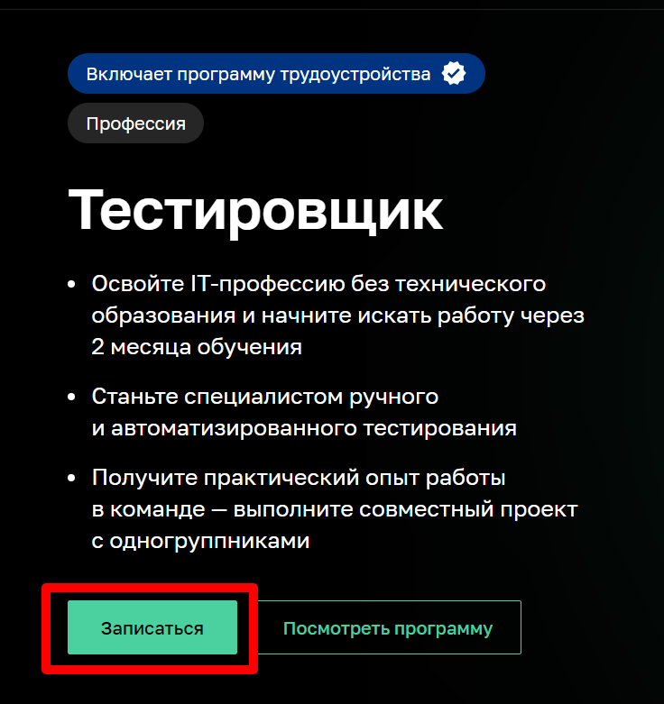

# **План автоматизации**

## Перечень автоматизируемых сценариев
1. Автоматизация путей перехода к форме записи на курс "Тестировщик ПО".(Необходимо проверить, что все ссылки на пути к форме записи на курс работают исправно и можно попасть к форме записи различными путями).

**Первый путь: через баннер на главной странице сайта**

**Второй путь: проскроллив сайт до раздела "Каталог курсов"**

**Третий путь: проскроллив сайт до раздела "Программирование""**

**Четвертый путь: воспользоваться поисковой строкой**

## Тестрирование формы записи на курс.

- Позитивные кейсы:
1. **Отправить заполненную форму**

   *Шаги воспроизведения:*
  
       1. Ввести в поле "Имя": Олег
       2. Ввести в поле "Номер телефона":+73472185962
       3. Ввести в поле e-mail: dkhr@mail.ru
       4. Отправить форму
     

*Ожидаемый результат*: Заявка отправлена успешно

2. **Использовать e-mail с разными доменами**

*Шаги воспроизведения:*

       1. Ввести в поле "Имя": Артем
       2. Ввести в поле "Номер телефона":+73472185962
       3. Ввести в поле "e-mail": dkhr@rumbler.ru
       4. Отправить форму
       5. Обновить страницу
       6. Ввести в поле "Имя": Илья
       7. Ввести в поле "Номер телефона": +79012560052
       8. Ввести в поле "e-mail": ilvin@yandex.ru
       9. Обновить страницу
       10. Ввести в поле "Имя": Антон
       11. Ввести в поле "Номер телефона": +79090218814
       12. Ввести в поле "e-mail": kinikanton@yandex.ru

  
  *Ожидаемый результат:* Заявки отправляются успешно

     
- Негативные кейсы:
1. **Отправить пустую форму**

 *Шаги воспроизведения:* 
 
       1. Оставить поля ввода пустыми   
       2. Отправить форму
          
  *Ожидаемый результат:* Пустые поля подсвечиваются красным, Ошибка: "Обязательное поле"
   
  2. **Использовать латиницу в поле ввода имени**

   *Шаги воспроизведения:*
   
      1. Ввести в поле ввода имени "Oleg"

      
  *Ожидаемый результат:* Поле подсвечивается красным, Ошибка: "Значение поля должно содержать только русские буквы"
  
  3. **Использовать числа в поле ввода имени**

  *Шаги воспроизведения:* 
  
     1. Ввести в поле для ввода имени: "12345" 

     
  *Ожидаемый результат:* Поле подсвечивается красным, Ошибка: "Значение поля должно содержать только русские буквы"

  4. **Отправить форму с заполненным полем "Имя" и пустыми полями: "Номер телефон", "e-mail"**

   *Шаги воспроизведения:*

   
      1. Ввести в поле для ввода имени: "Олег"
      2. Отправить форму
   
   
   *Ожидаемый результат:* Пустые поля подсвечиваются красным, Ошибка: "Обязательное поле"
  
  5. **Использовать буквы в поле ввода номера телефона**

   *Шаги воспроизведения:*
   
       1. Ввести в поле ввода номера телефона: "абвг"

       
  *Ожидаемый результат:* Поле остается пустым
    
  6. **Использовать символов в поле ввода номера телефона**

   *Шаги воспроизведения:*
   
       1. Ввести в поле ввода номера телефона:"-"
       
  
  *Ожидаемый результат:* Поле остается пустым.
    
  7. **Использовать код номера телефона другой страны**

   *Шаги воспроизведения:*
   
       1. Ввести в поле ввода номера телефона: "+375297057570"

       
  *Ожидаемый результат:* Поле подсвечивается красным, Ошибка: "Неверный формат номера телефона"
 
  8. **Отправить форму с заполненным полем "Номер телефона" и пустыми полями: "Имя", "e-mail"**

     *Шаги воспроизведения:*

    1. Ввести в поле ввода номера телефона:"+73472185962"
    2. Отправить форму

*Ожидаемый результат:* Пустые поля подсвечиваются красным, Ошибка: "Обязательное поле"

  9. **Использовать кириллицы в поле ввода e-mail**

     *Шаги воспроизведения:*

         1. Ввести в поле ввода e-mail: "абвгд"

*Ожидаемый результат:* Поле подсвечивается красным, Ошибка: "Неверный формат e-mail"
  
  
  10. **Отправить форму с заполненным полем "e-mail" и пустыми полями: "Имя", "Номер телефона"**

      *Шаги воспроизведения*

           1. Ввести в поле ввода e-mail: dkhr@mail.ru
     

*Ожидаемый резултат:* Пустые поля подсвечиваются красным, Ошибка: "Обязательное поле"

## Перечень используемых инструментов с обоснованием выбора

1. Selenide - для удобства работы с PageObject
2. Lombok - для уменьшения количества кода, который необходимо написать для работы автотестов
3. JavaFaker - для генерации информации о пользователе
4. MySQL - для работы с базами данных
5. Docker - для подготовки и использования контейнера поддерживающий MySQL
6. Allure - для подробных и удобных для чтения и понимания отчетов по итогам тестов.

## Перечень необходимых разрешений, данных и доступов.

В первую очередь, для реализации проекта необходимо разрешение на автоматизированное тестирование. В случае, если такое разрешение будет получено, необходимо запросить доступ к базам данных сервиса для корректной работы автотестов, например, при отправке валидной формы записи на курс, необходимо убедиться, что данные пользователя попадают в базу данных, а менеджер получает необходимую информацию для связи с пользователем.

## Перечень и описание возможных рисков при автоматизации.

В случае изменений в веб приложении, можно будет столкнуться с проблемой изменений CSS селекторов, что приведет к неисправной работе уже имеющихся автотестов и повлечет за собой необходимость исправления существующих тестов.
Если проводится тестирование на готовом продукте, есть опасность "сломать" веб приложение, что повлечет за собой отток потенциальных пользователей, поскольку сервис будет недоступен.
Также больши риском может быть "автоматизация ради автоматизации", необходимо тщательно провести анализ и принять решение о необходимости автоматизации на проекте, посколку процесс создания автотестов является трудоемким и затратным.

## Перечень необходимых специалистов для автоматизации.

Для реализации данного проекта команде нужен специалист по автоматизированному тестированию.

## Интервальная оценка с учётом рисков в часах.

С учетом рисков, подготовка и настройка автотестов для конкретной задачи может потребоваться около 96-100 часов.
